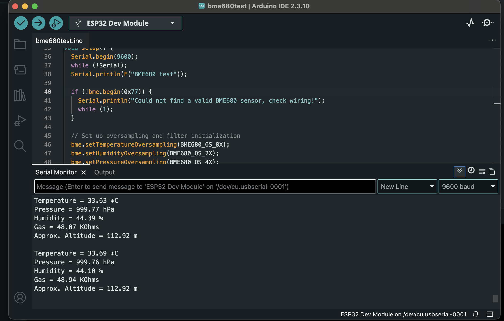

# ESP32 Air Quality Sensor

A simple air quality monitoring project using an ESP32 microcontroller and a BME680 sensor, reading temperature, humidity, pressure, and gas resistance in real time.

## Hardware
- ESP32 Dev Module
- BME680 sensor (I2C)

## Wiring
- VCC → 3V3
- GND → GND
- SDA → D21
- SCL → D22

## Software
- Arduino IDE
- Adafruit BME680 library

## Status
✅ Sensor wired and reading live data via Serial Monitor
🔜 Next: publish data over WiFi via MQTT

## Photos

